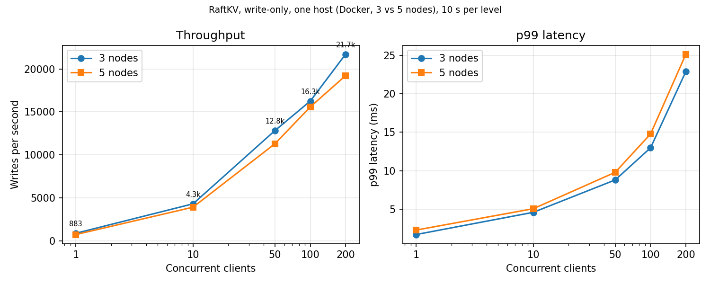

# RaftKV

[](https://github.com/LIGHT-YAGAMI-61/raftkv/actions/workflows/ci.yml)
[](LICENSE)

A distributed key-value store in Go with the **Raft consensus algorithm implemented from scratch** (no Raft library), following Ongaro & Ousterhout, *In Search of an Understandable Consensus Algorithm*. Nodes talk over gRPC and run natively or in Docker, as 3 or 5 nodes.

**Results at a glance**

- **21,714 writes/s** on a 3-node cluster (200 concurrent clients, p99 22.9 ms, 0 failed operations). All nodes and the load generator share one machine, so this measures the implementation, not a real network. [Details](#benchmarks)
- **0 acknowledged writes lost** across 5 Docker fault scenarios (pause, partition, leader isolation, leader kill, whole-cluster kill), judged by a consistency checker. [Details](#layer-3-docker-fault-tests-and-the-checker)
- **A bug the chaos suite missed:** after a whole-cluster restart, acknowledged writes read back as "not found". Docker fault testing found it and a leader no-op (§8) fixed it. [The story](#1-the-no-op-bug-found-by-docker-fault-testing)

What's implemented:

- Leader election with randomized timeouts (§5.2) and the **PreVote** extension (thesis §9.6)
- Log replication with a per-peer replicator and batched writes (§5.3)
- Safety rules: election restriction (§5.4.1) and current-term-only commit (§5.4.2)
- Persistence and crash recovery: hard state plus an append-only log file
- Snapshots, log compaction and `InstallSnapshot` (§7)
- `Put` / `Get` / `Delete` with leader redirect, and ReadIndex-style reads (§8). See the [consistency model](#consistency-model) for exactly what is and isn't guaranteed.
- Three layers of tests: unit tests, an application-level chaos suite, and Docker fault tests judged by a checker

> Section numbers (§) refer to the Raft paper unless marked "thesis" (Ongaro's dissertation).

## Contents

1. [Try it](#try-it)
2. [Architecture](#architecture)
3. [Consistency model](#consistency-model)
4. [Running it](#running-it)
5. [Benchmarks](#benchmarks)
6. [Bug-hunt stories](#bug-hunt-stories)
7. [Testing](#testing)
8. [Limitations](#limitations)
9. [Next steps](#next-steps)

## Try it

Needs Docker with Compose v2. Three commands:

```bash
git clone https://github.com/LIGHT-YAGAMI-61/raftkv.git && cd raftkv
docker compose up --build -d
docker compose run --rm client -nodes node1:5001,node2:5001,node3:5001 put hello world
```

A shorthand for the rest of this section:

```bash
# bash / zsh
kv() { docker compose run --rm client -nodes node1:5001,node2:5001,node3:5001 "$@"; }
```
```powershell
# PowerShell
function kv { docker compose run --rm client -nodes node1:5001,node2:5001,node3:5001 @args }
```

```text
$ kv put hello world
OK
$ kv get hello
world
$ kv delete hello
OK
$ kv get hello
(not found)
```

**Kill the leader and keep reading.** Find the leader (the highest term wins), kill it, and read again:

```bash
docker compose logs --no-color | grep "becoming LEADER"     # PowerShell: ... | findstr "becoming LEADER"
docker compose kill node1            # replace node1 with the node from the highest term above
kv get hello                         # answers after a short election (about 2 s in the fault runs)
docker compose start node1           # the old leader rejoins as a follower
```

Stop and wipe everything with `docker compose down -v`.

<!-- Optional: add a short screen recording of the leader-kill demo as docs/failover.gif and embed it here. -->

The Go client is also a library (`client/client.go`): `client.New(addrs)` then `Put(k, v)`, `Get(k)` → `(value, found, err)` and `Delete(k)`. It follows leader hints, reuses connections, and retries with jittered backoff.

## Architecture

```
                         ┌──────────────────────────── leader ────────────────────────────┐
 client SDK ─ Put/Del ─▶ │ KV gRPC ─▶ submitCh ─▶ batcher ─▶ append + 1 disk write/batch   │
   (follows              │                                        │                        │
    leader_hint)         │                          per-peer replicators ──AppendEntries──▶ followers
                         │                                        │                        │
 client SDK ─── Get ───▶ │ ReadIndex + confirm leadership         ▼                        │
                         │ applyCommitted ◀── advanceCommitIndex (majority, current term)  │
                         │ kvStore (map) ──▶ wakes waiting request (sync.Cond) ──▶ reply  │
                         └─────────────────────────────────────────────────────────────────┘
```

### Write path

1. A client sends `Put`/`Delete` to any node. A non-leader returns `Ok:false` with a `leader_hint`; the client SDK redirects.
2. On the leader, `SubmitCommand` enqueues the command on `submitCh` and blocks in `waitForApply` (2 s deadline).
3. A single **batcher** goroutine drains the channel (up to 128 commands per batch), appends the batch to the log under `n.mu`, and persists it with **one** disk write per batch.
4. One **replicator** goroutine per peer sends `AppendEntries` (up to 256 entries per RPC). Heartbeats (every 50 ms) just kick the same replicators. A peer that has fallen behind the snapshot point gets `InstallSnapshot` instead.
5. `advanceCommitIndex` commits an index once a majority has it **and** it belongs to the leader's current term (§5.4.2).
6. `applyCommitted` applies entries to the in-memory `kvStore` and wakes the waiting request through a `sync.Cond`.

### Read path

Reads go through the leader (§8). `ReadIndexGet` takes `readIndex = max(commitIndex, noopIndex)`, confirms the node is still leader with a bare heartbeat round that returns as soon as a majority answers, waits until `readIndex` is applied, re-checks that it is still leader in the same term, and then reads the map. `noopIndex` is the no-op entry every new leader appends when it is elected ([story 1](#1-the-no-op-bug-found-by-docker-fault-testing)).

### Election

Election timeouts are randomized in 300–600 ms; heartbeats go out every 50 ms. Before a node bumps its term and runs a real election it runs a **PreVote** round, and a node that has heard from a leader recently, or is the leader, refuses to pre-vote. A slow or partitioned node therefore can't disrupt a healthy leader.

### Persistence

| File (per node) | Contents |
|---|---|
| `data/<id>.json` | hard state: `currentTerm`, `votedFor` |
| `data/<id>-wal.jsonl` | the log, one JSON entry per line, append-only |
| `data/<id>-snapshot.json` | latest snapshot (KV state + last included index/term) |

State is persisted before the reply for votes and `AppendEntries`. A torn last line in the log file (crash mid-append) is dropped on load. Whole-file writes use temp file + rename, with a short retry for Windows file-lock errors. `commitIndex` is deliberately not persisted (Figure 2). **There is no `fsync`** (see [Limitations](#limitations)).

### Snapshots

Once the log reaches `RAFTKV_SNAPSHOT_THRESHOLD` entries, the node copies the KV map under the lock, releases the lock while writing the snapshot file, then truncates the log. A follower that is too far behind receives the snapshot through `InstallSnapshot`; the receiver writes the snapshot file *before* it touches in-memory state.

### Repository layout

```
proto/               raft.proto, kv.proto, chaos.proto (+ generated .pb.go, committed)
raft/                node.go, election.go, replicator.go, batcher.go, commit.go, persist.go,
                     snapshot.go, kv.go, log.go, command.go, errors.go, state.go, config.go,
                     chaos_control.go, and *_test.go
server/kv_server.go  KV gRPC handlers
client/client.go     SDK: leader redirect, connection reuse, retry + jittered backoff
cmd/node             server binary (-id required, -config defaults to config.json)
cmd/client           CLI: client -nodes a,b,c <get|put|delete> key [value]
cmd/bench            load generator (throughput, p50/p95/p99/max, warm-up)
cmd/chaos            chaos suite
cmd/checker          consistency checker
scripts/faults.ps1   Docker fault-injection runner (Windows PowerShell)
logs/                raw benchmark and fault-test output cited below
docs/                chart
Dockerfile, docker-compose.yml, docker-compose.5.yml
config.json, config5.json, config.docker.json, config5.docker.json
```

## Consistency model

**What holds, and what was tested**

- A write that was acknowledged is never lost. Committed entries survive leader changes, partitions, crashes and a whole-cluster restart (checker: 0 violations in all five fault scenarios).
- Reads confirm leadership with a majority and wait for the state machine to catch up, so a deposed leader can't serve a stale read.
- Writes are applied in log order on every node.

**What is *not* guaranteed: retries are at-least-once**

The client retries a request when it times out or when leadership changes. The leader may still commit the original request after the client gave up (the wait for apply has a 2 s deadline). There is no request-ID deduplication, so a retried `Put(k, 1)` can be applied *after* another client's `Put(k, 2)`, and a reader can then observe `1 → 2 → 1`. Making `Put` idempotent doesn't prevent this. Client sessions with request-ID dedup (thesis §6.3) would. They aren't built yet, and are the first item under [Next steps](#next-steps).

**The checker is not a full linearizability checker.** It uses one writer per key, so it can't exercise the scenario above. It verifies that acknowledged writes are never lost or read backwards. It does not verify linearizability of concurrent multi-writer histories. Treat "linearizable" here as "the Raft log and ReadIndex design provide it, absent client retries", not as a proven property of the whole system.

## Running it

**Prerequisites:** Go (version in `go.mod`) for native runs and tests; Docker with Compose v2 for the Docker setup. The generated `.pb.go` files are committed, so `protoc` is only needed if you edit `proto/*.proto`.

The snippets are PowerShell, since the project was developed on Windows. Only the PowerShell snippets and `scripts/faults.ps1` are Windows-specific; `make` targets (see the `Makefile`) and the bash lines below work on macOS and Linux.

### Native

```powershell
go build -o bin/node.exe   ./cmd/node
go build -o bin/client.exe ./cmd/client
go build -o bin/bench.exe  ./cmd/bench
go build -o bin/chaos.exe  ./cmd/chaos
```

**3-node cluster** (`config.json`: node1–node3 on `localhost:5001`–`5003`). Run each node in its own terminal, starting all three close together:

```powershell
$env:RAFTKV_SNAPSHOT_THRESHOLD = "10000"
cmd /c ".\bin\node.exe -id node1 -config config.json 2> node1.log"
# same for node2 and node3
```

```bash
# bash equivalent
go build -o bin/node ./cmd/node
export RAFTKV_SNAPSHOT_THRESHOLD=10000
for i in 1 2 3; do ./bin/node -id node$i -config config.json 2> node$i.log & done
```

**5-node cluster:** the same with `-config config5.json` and node1–node5 (`localhost:5001`–`5005`).

`RAFTKV_SNAPSHOT_THRESHOLD` defaults to 5 so compaction is easy to exercise during development. The benchmarks used `10000`.

```powershell
.\bin\client.exe put hello world
.\bin\client.exe get hello
Select-String "becoming LEADER" node*.log                 # who leads
Select-String "starting election" node*.log | Group-Object Filename | Select-Object Name, Count
```

### Docker

**3 nodes** (`config.docker.json`, one named volume per node at `/app/data`):

```bash
docker compose up --build -d
docker compose ps
docker compose run --rm bench -nodes node1:5001,node2:5001,node3:5001 -duration 10s -concurrency 50 -read-ratio 0
docker compose down        # keeps the volumes (restart keeps data)
docker compose down -v     # wipes them (fresh cluster)
```

**5 nodes** use a separate compose file and project. That file reuses the `raftkv:latest` image, so build it first with the 3-node file (`docker compose build`):

```bash
docker compose -p raftkv5 -f docker-compose.5.yml up -d
docker compose -p raftkv5 -f docker-compose.5.yml run --rm bench \
  -nodes node1:5001,node2:5001,node3:5001,node4:5001,node5:5001 -duration 10s -concurrency 50 -read-ratio 0
# the CLI client on the 5-node cluster
docker compose -p raftkv5 -f docker-compose.5.yml run --rm --entrypoint /app/client bench \
  -nodes node1:5001,node2:5001,node3:5001,node4:5001,node5:5001 get hello
docker compose -p raftkv5 -f docker-compose.5.yml down -v
```

The snapshot threshold is set by `RAFTKV_SNAPSHOT_THRESHOLD` in each compose file. The 3-node file also publishes ports 5001–5003 (for `grpcurl`); use `docker compose run` for the CLI, since leader hints carry in-network addresses.

## Benchmarks

**Read this first.** Everything ran on **one machine** (Windows, 16 logical cores; Docker Desktop with 16 CPUs / 7.4 GiB). The load generator and every node share that host, so there is no real network latency or independent failure domain. The numbers measure the implementation's overhead (batching, replication, disk writes), not what a multi-machine deployment would see. Each configuration is a single sweep; read the figures as indicative.

**Method:** write-only workload (`-read-ratio 0`), 10 s per concurrency level after a 3 s warm-up that isn't measured, fresh cluster, `RAFTKV_SNAPSHOT_THRESHOLD=10000`, final code. A sweep counts only if the election count was the same before and after (no leader change mid-run). Raw output is in `logs/`.



### 3 nodes, healthy (Docker)

0 failed operations at every level.

| Concurrency | Ops | Throughput (ops/s) | p50 (ms) | p95 (ms) | p99 (ms) | Max (ms) |
|---:|---:|---:|---:|---:|---:|---:|
| 1 | 8,828 | 882.8 | 1.10 | 1.44 | 1.70 | 3.52 |
| 10 | 43,109 | 4,310.9 | 2.18 | 3.68 | 4.59 | 12.15 |
| 50 | 128,358 | 12,835.8 | 3.56 | 6.77 | 8.80 | 17.73 |
| 100 | 162,651 | 16,265.1 | 5.19 | 9.95 | 12.97 | 814.02 ¹ |
| 200 | 217,141 | 21,714.1 | 8.29 | 16.88 | 22.89 | 81.72 |

### 3 nodes, leader killed mid-run (Docker)

Concurrency 50, 40 s, write-only. The leader (node2) was hard-killed about 10 s in and restarted 8 s later. 0 failed operations.

| Ops | Throughput (ops/s) | p50 (ms) | p95 (ms) | p99 (ms) | Max |
|---:|---:|---:|---:|---:|---:|
| 371,894 | 9,297.4 | 3.91 | 10.18 | 13.43 | 1,861 ms ² |

- node3 won term 2 after the kill. The client SDK's retry and redirect logic absorbed the failover, so no operation ultimately failed. The 1,861 ms maximum is the worst single request over the whole run, which includes the failover.
- The restarted node2 rebuilt from its on-disk log, then caught up by installing snapshots at indices 139,880, 259,725 and 339,580 while the leader kept taking writes.

### 5 nodes, healthy (Docker)

Same method, separate compose project. 0 failed operations at every level. A write needs 3 of 5 acknowledgements instead of 2 of 3.

| Concurrency | Ops | Throughput (ops/s) | p50 (ms) | p95 (ms) | p99 (ms) | Max (ms) |
|---:|---:|---:|---:|---:|---:|---:|
| 1 | 7,349 | 734.9 | 1.31 | 1.80 | 2.28 | 3.94 |
| 10 | 39,201 | 3,920.1 | 2.37 | 4.11 | 5.06 | 9.19 |
| 50 | 113,049 | 11,304.9 | 4.07 | 7.46 | 9.79 | 20.21 |
| 100 | 155,851 | 15,585.1 | 5.84 | 11.31 | 14.77 | 27.54 |
| 200 | 192,246 | 19,224.6 | 9.39 | 19.08 | 25.13 | 47.47 |

At concurrency 200, 5 nodes reach 19,224.6 ops/s against 21,714.1 for 3 nodes. All five containers share one CPU and memory bus, so this doesn't predict the gap between separate machines.

¹ ² Two unexplained observations: one 814 ms request at concurrency 100 with no election during the run, and a second leader change (node1 won term 3) in the leader-kill run while node3 appeared healthy. See [Open observations](#open-observations).

## Bug-hunt stories

### 1. The no-op bug, found by Docker fault testing

**Symptom.** In the first Docker fault pass, scenarios A–D passed (pause a follower, partition a follower, isolate the leader, kill the leader under load). Scenario E, a **whole-cluster kill and restart**, failed: all 20 keys the client had been acknowledged for read back as "not found".

**Diagnosis.** The data was on disk; it just wasn't applied. `commitIndex` is volatile by design (Figure 2), so after every node restarts nothing is committed until a leader commits an entry. §5.4.2 forbids a new leader from committing entries of earlier terms by counting replicas; they commit only indirectly, when an entry from the leader's *own* term commits after them. With no new client write arriving, the old acknowledged entries sat unapplied indefinitely, and reads served from the state machine saw nothing.

**Fix (§8, §5.4.2).** `becomeLeader()` now appends a no-op entry (`OpNoop`) in its own term and records its index in `noopIndex`. Committing the no-op commits everything before it, and `ReadIndexGet` uses `readIndex = max(commitIndex, noopIndex)`, so a read can't be served before the new leader has caught up.

**Result.** Scenario E passed: 20/20 acknowledged keys read back with no extra trigger write. The chaos suite passed again, and a concurrency-50 sweep was clean (0 failed of 53,354 operations).

**Why the chaos suite missed it.** The chaos suite injects faults into a running cluster. Nothing in it restarts the *entire* cluster and then reads back previously acknowledged writes, which is the situation that exposed the bug. That is why the Docker layer exists.

### 2. The `persist()` stall, found with timing logs

**Symptom.** On Docker, a healthy 3-node sweep kept losing its leader mid-run. The first sweep logged 6 elections in total, and later sweeps still saw up to 7 new elections each. One run had 392 failed operations at concurrency 100 and another had 71, with 1–2 s maximum latencies at concurrency 10–100. The same code on a native cluster with PreVote had been clean (one election), so PreVote wasn't the missing piece.

**What was ruled out.** Snapshot compaction was the first suspect, since it copies the whole KV map. Raising `RAFTKV_SNAPSHOT_THRESHOLD` to 10000 (confirmed inside the container with `printenv`) cut compaction to 42 events across the logs, yet the churn and failures remained. Compaction wasn't the cause.

**What the plain logs showed.** About 1,600–1,700 `batch size` lines and a few hundred `applied entries` lines in the 4 s before each leader lost leadership, and nothing else. The logs said what the leader was doing but not where the time went.

**Timing logs.** I added timing around `persist()`, the leader heartbeat's wait for `n.mu`, and the heartbeat gap:

- `persist` took **1.606 s** on node1 and node2 in the same second, at a log length of 3,025 entries
- repeated `persist` times of **77–231 ms** at a log length around 4,700
- one heartbeat **waited 298 ms for `n.mu`**, leaving a **343 ms heartbeat gap**, which is more than the 300 ms minimum election timeout
- the `persist` time inside `appendBatch` lined up with those stalls

**Root cause.** `persist()` serialized the **entire log to JSON and rewrote the whole file** on every batch, while holding `n.mu`. The cost grows with log length, so under sustained writes the batcher held the lock long enough to starve the heartbeat goroutine. Followers' election timers then expired and deposed a healthy leader.

**Fix.** Replace whole-log rewrites with an append-only log file (`data/<id>-wal.jsonl`, one JSON entry per line) plus a small hard-state file for term and `votedFor`, in small steps with the chaos suite rerun after each: split hard state from the log; make `appendBatch` append only new entries; make the follower `AppendEntries` path and term/vote-only changes write only what changed. A log truncation (conflict) or compaction marks the file for a full rewrite.

**Result** (Docker 3-node, write-only, 10 s per level):

| Concurrency | Before: ops/s | After: ops/s | Before: max latency | After: max latency |
|---:|---:|---:|---:|---:|
| 1 | 334.7 | 887.1 | 39.2 ms | 9.8 ms |
| 10 | 1,325.6 | 4,366.8 | 2.007 s | 9.4 ms |
| 50 | 4,817.1 | 12,943.5 | 1.26 s | 14.2 ms |
| 100 | 7,686.4 | 17,865.6 | 1.37 s | 27.8 ms |
| 200 | 11,883.2 | 21,883.8 | 43.6 ms | 43.4 ms |

Elections during the sweep went from 6 to 1 (the initial one). This sweep still had the temporary timing logs in the code; the final benchmarks above are on clean code.

### 3. A test that passed for the wrong reason

While preparing the final fault results, the scripted `cluster-kill` scenario reported `PASS` with a 58 ms gap and 0 failed writes. Killing all three nodes can't look like that. Checking election timestamps showed the bug was in the **test harness**, not Raft:

- finding the leader meant parsing an ever-growing `docker compose logs`, which took about 28 s, so the fault was injected late or not at all, and
- the helper that looks up container IDs (`docker compose ps -q`) omits stopped containers, so the "restart" step silently restarted nothing.

The fix was `ps -a -q`, a fresh cluster per fault (so the logs stay small), and checking elections against timestamps. The final run is the one reported below. The lesson: a green result that is too clean needs its own check.

### Smaller bugs found along the way

- Redundant re-compaction in `maybeSnapshot`; fixed with an early-return guard.
- `persist()` called `log.Fatalf` on a Windows file-lock error during rename; it now logs and retries.
- Snapshot code changed in-memory state and truncated the log *before* the snapshot write succeeded (in both `maybeSnapshot` and `InstallSnapshot`); it now changes state only after the write succeeds.
- The KV server returned `Ok:false` with no error for failures other than "not leader", so a read during a leader change looked like "key not found". The checker caught it; handlers now return `Unavailable`.
- One gRPC connection per call collapsed at 200 concurrent workers (1,499 of 1,519 operations failed); with a connection cache, 0 failed.

## Testing

```bash
go test -race ./...        # layer 1: unit tests (also run in CI)
```

### Layer 1: unit tests

`raft/*_test.go` covers the pieces whose bugs are subtle and cheap to test in isolation (all run in a temp directory):

- **Persistence:** hard state and log round-trip; appending only new entries; a torn last line is dropped and later appends land cleanly; truncate-then-append rewrites the file; a shrunk log forces a rewrite; a legacy log embedded in the state file still loads
- **Log indexing:** `lastLogIndex`, `lastLogTerm`, `termAt` and `sliceIndex` before and after compaction
- **Commit rule (§5.4.2):** entries from earlier terms are not committed by counting replicas, and commit once an entry from the current term does; majority thresholds for 3 and 5 nodes; apply of put/delete/no-op
- **Elections (§5.2, §5.4.1):** at most one vote per term, stale terms and stale logs are refused, the vote survives a restart; PreVote changes no state and is refused while a leader is alive
- **Log matching (§5.3):** `AppendEntries` rejects a missing or mismatched previous entry, truncates a conflicting suffix, ignores duplicates, refuses a stale leader, and advances the commit index
- **Snapshots:** restart skips entries covered by a snapshot; `maybeSnapshot` compacts and survives a restart

What they do *not* cover: the replicator, the batcher, `InstallSnapshot` over the network, and the client. Those are exercised by the chaos suite and the Docker fault tests below.

### Layer 2: chaos suite (application-level faults)

```powershell
.\bin\chaos.exe
```

`cmd/chaos` starts a 3-node cluster as local processes and, for about 25 s, applies random partitions, kills and delays through a `ChaosControl` gRPC service on each node (`SetPartition`, `SetDelay`, `GetStatus`) while a background writer sends traffic and an invariant checker watches for:

- no two leaders in the same term
- no committed (acknowledged) entry ever lost

Many client writes being rejected during faults is expected. Faults are simulated at the application level (nodes drop or delay RPCs), which is a deliberate simplification. Final result: **PASS** (79 writes acknowledged, 0 lost, no two-leader violation).

### Layer 3: Docker fault tests and the checker

This layer uses real OS-level faults on the Docker cluster, with a separate program judging the result.

**The checker** (`cmd/checker`) runs one writer goroutine per key. Each writes an increasing sequence 1, 2, 3, … and reads the key back after every acknowledged put. It enforces:

- `acked <= read <= acked + 1` (the extra 1 allows a write whose acknowledgement was lost)
- a read never goes below a value that key has already returned
- after the run, a final verification pass (retrying for up to 30 s) finds every key readable and at least its last acknowledged value

It reports puts acknowledged and failed, failed gets, the longest gap between successful writes, and the first violations, and it prints `RESULT: PASS` or `RESULT: FAIL`.

```bash
docker compose run --rm checker -nodes node1:5001,node2:5001,node3:5001 -keys 30 -duration 60s
```

**The fault runner** (`scripts/faults.ps1`, Windows PowerShell) does, for each fault: wipe and recreate the 3-node cluster, start the checker (30 keys, 60 s), wait 15 s, inject the fault, and read PASS/FAIL from the checker's own `RESULT:` line, not the process exit code.

```powershell
.\scripts\faults.ps1                          # all five faults
.\scripts\faults.ps1 -Faults leader-kill      # one fault
.\scripts\faults.ps1 -OutDir logs\my-run      # where results are written
```

| Fault | How it is injected | Puts acked | Puts failed | Gets failed | Longest gap ³ | Violations | Result |
|---|---|---:|---:|---:|---:|---:|---|
| follower-pause | `docker pause` a follower for 15 s | 255,112 | 0 | 0 | 36 ms | 0 | PASS |
| follower-partition | disconnect a follower from the network for 15 s | 280,237 | 0 | 0 | 14 ms | 0 | PASS |
| leader-isolate | disconnect the leader from the network for 15 s | 271,460 | 0 | 0 | 2.01 s | 0 | PASS |
| leader-kill | `docker kill` the leader, restart it 15 s later | 268,123 | 16 | 14 | 2.25 s | 0 | PASS |
| cluster-kill | kill all three nodes, restart them 10 s later | 189,837 | 170 | 159 | 13.44 s | 0 | PASS |

Raw output: `logs/final3/`. For the cluster-kill run, the log shows node2 winning term 2 right after the restart, which matches the 13.4 s gap.

³ The longest gap between two successful writes. It doesn't count an outage that never recovers; the end-of-run verification would flag that as a violation, and that is how the harness bug in [story 3](#3-a-test-that-passed-for-the-wrong-reason) showed up. Failed puts and gets are expected while no leader exists. The pass condition is that nothing the checker was told succeeded is lost or read backwards.

Each fault ran once on a fresh cluster. Reconnecting a node after a partition needs its network alias back, or its name stops resolving: `docker network connect --alias node1 raftkv_default <container>`.

## Limitations

- **Single host.** All benchmark and fault-test numbers come from one machine; every node competes for the same CPU, memory and disk. Real network latency, packet loss and independent machine failure were not tested.
- **No `fsync`.** Log, hard-state and snapshot writes go through the OS page cache. The tests kill *processes and containers*, which this survives; a power loss or OS crash could lose acknowledged writes. This is a known, accepted gap.
- **Retries are at-least-once.** No request-ID deduplication; see the [consistency model](#consistency-model).
- **The checker is not a linearizability checker.** One writer per key; it detects lost and backwards-read writes, not arbitrary concurrent histories.
- **Compaction rewrites the log file in full.** Appends are incremental, but compaction and log truncation still rewrite the whole file. After compaction the log is short, but the rewrite happens under the node lock.
- **Snapshots copy the whole KV map.** Cost grows with data size. `InstallSnapshot` sends the full snapshot in a single RPC (no chunking), bounded by the gRPC message-size limit, and the receiver discards its entire log rather than keeping a matching tail. Large datasets are a known weak spot.
- **No transport security.** gRPC uses insecure credentials with no authentication, and the node also exposes the fault-injection `ChaosControl` service. Don't expose node ports to untrusted networks.
- **Static membership.** No cluster membership changes (§6); the node set is fixed in the config file.
- **Reads go through the leader.** Each read confirms leadership with a heartbeat round; there are no follower reads or leader leases.
- **Limited fault model.** Tested: process kills, pauses, whole-cluster restarts and network disconnects. Not tested: disk corruption or full disks, clock skew, asymmetric or flapping partitions, and Byzantine faults (Raft assumes none).
- **Test coverage gaps.** The unit tests don't cover the replicator, batcher, `InstallSnapshot` over the wire or the client; those rely on the chaos and fault tests.
- **Benchmarks are single runs on one workload.** Write-only, 10 s per level, one sweep per configuration.

### Open observations

Three things I saw and did not investigate:

1. A single 814 ms request at concurrency 100 in the 3-node sweep, with no election during the run.
2. A second leader change (node1 won term 3) during the leader-kill benchmark while node3 appeared healthy.
3. Leader churn returned with `RAFTKV_SNAPSHOT_THRESHOLD=1000`: a 3-node sweep that was clean at `10000` had 4 new elections (still 0 failed operations).

Ruled out: the `persist()` stall ([story 2](#2-the-persist-stall-found-with-timing-logs), fixed) and compaction as the cause of the *original* churn. A plausible but unmeasured cause for all three is the node lock being held too long by snapshotting (the whole-map copy) or by building snapshot data for a lagging follower. That is a hypothesis, not a finding. This is also why the benchmarks use `10000`, and why the default threshold of 5 is only suitable for testing.

## Next steps

1. Client sessions with request-ID deduplication (thesis §6.3), then rerun the whole test suite
2. An optional `fsync` mode, with the throughput cost measured
3. A linearizability check over concurrent multi-writer histories (for example with Porcupine)
4. Timing instrumentation around snapshotting to resolve the open observations
5. Chunked `InstallSnapshot`, and cluster membership changes (§6)

## License

[MIT](LICENSE)
